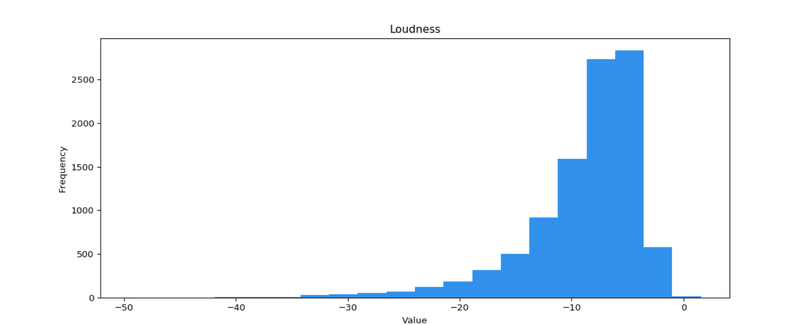

# Music_Taste_Analysis
This is the user tastes analysis using Spotify API.
- Learn how to connect the Spotify API
  - Eg. Autheticating from the user with specified scope
- EDA on the songs available in the libary
- Clustering analysis on the songs
- Build personalized recommendation system

The features used for the analysis can be found [here](https://developer.spotify.com/documentation/web-api/reference/tracks/get-audio-features/)
- `duriation_ms`: The duration of the track in the milliseconds.
- `key`: The estimated overall key of track. Integers map to pitches using the standard `Pitch Class notation`.
- `mode`: Mode indicates the modality(major or minor) of a track, the type of scale from which its medlodic content derived. Major is represented by 1 and minor is 0.
- `time_signature`: An estimated overalltime of a track. The time signature(meter) is a notational convention to specify how many beats in a bar(a measure).
- `acounsticness`: A confidence measure from 0.0 to 1.0 of whether the track is acoustic. 1.0 represents high confidence the track is acoustic. The distribution of values for this feature look like this:

- `danceability`: Danceability describes how suitable a track is for dancing based on a combination of musical elements including tempo,rhythm stability,beat strength,and overall regularity. A value of 0.0 is least danceable annd 1.0 is most danceable. The distribution of values for this feature looks like this: 

- `energy`: Energy is a measure from 0.0 to 1.0 and represents a perceptual measure of intensity and activity Typically,energetic tracks feel fast,loud,and noisy, For example,death metal has high energy,while a Bach prelude scores low on the scale. Perceptual features contributing to this attribute include dynamic range, perceived,loudness,timbre,onset rate,and general entropy. The distribution of values for this feature look like is:

- `Instrumentalness`: Predicts whether a track contains no vocals. "Ooh" and "aah" sounds are treated as instrumental in this context. Rap or spoken word tracks are clearly "vocal". The closer the instrumentalness is to 1.0, the greater likelihood the track contains no vocal content. Values above 0.5 are intended to represent instrumental tracks,but confidence is higher as the value approaches 1.0. The distribution of values for this feature look like this:

- `liveness`:Detects the presence of an audience in the  recording. Higher liveness values represented an increased probability that the track was performed live. A value above 0.8 provides strong likelihood that the track is live. The distribution of values for this feature look like this:

- `loudness`: The overall loudness of a track in deibels(dB). Loudness values are averaged across the entire track and are useful for comparing relative loudness and are useful for comparing relative loudness of tracks. Loudness is the quality of a sound that is the primary psychological correlate of phychological correlate of physical strength(amplitude). Values typical range between -60 and 0 db. The distribution of values for this feature look like this:

- `speechiness`: Speechiness detects the presence of spoken words in a track. The more exclusively speech-like the recording(e.g. talk show,audio book,poetry),the closer to 1.0 the attribute value. Values above 0.66 describe tracks that are probably made entirely of spoken words. Values between 0.33 and 0.66 describe track that may contain both music and speech, eithr in sections or layered, including such cases as rap music. Values below 0.33 most likely represent music and other non-speech-like tracks. The  distribution of values for this feature look like this:

- `valence`: A measure from 0.0 to 1.0 describing the musical positiveness conveyed by a track. Tracks with high valence sound more positive(e.g. happy, cheerful,euphoric), while tracks with low valence sound more negative(e.g.sad,depressed,angry).The distribution of values for this feature look like this:

- `tempo`: The overall estimated tempo of a track in beats per minute(BPM). In musical terminology, tempo is the speed or pace of a given piece and derives directly from the average beat duration. The distribution of values for this  feature look like this:

- Have Fun!

